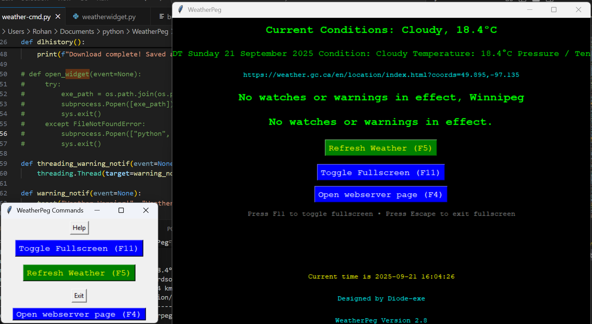
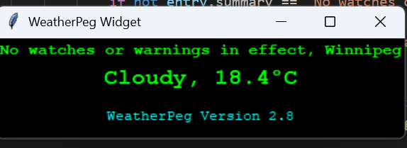

# WeatherPeg

## Your one-stop shop for the current weather in Winnipeg

Everything is included, just run the .exe

There is no exe for Linux, as, obviously, exe's don't run on Linux. weather-cmd-no-speech.py is for Linux, no speech the API I use for speech is from win32api 

I fixed the exe. Check the git blame to see what I did. 

Use build.py for building both console and no console windows, or use build.txt for just the console version. 

https://discord.gg/2M4PxAuQt8

Official server of WeatherPeg

source.txt is where you put the link to the XML file for information sourcing. Examples in examples.txt. 

This may work with other weather services, I don't know. It will work for Canadian cities, though. 

Webserver defaults to port 2046, but can be changed in config.txt

https://localhost:2046/weather

The delay numbers in config.txt are in milliseconds

### Note

weather-qt.py is failed port of WeatherPeg to PyQT.

### Hotkeys

F5 to manually refresh, F8 to switch between widget and full mode, F11 for fullscreen, Escape to leave fullscreen, F6 to open the external command window, F4 to open the webserver page. 

## Screenshots

